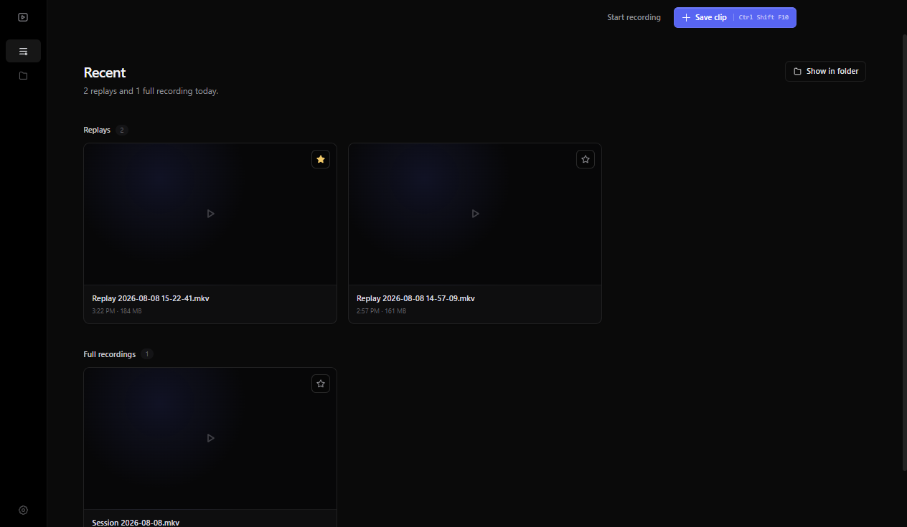
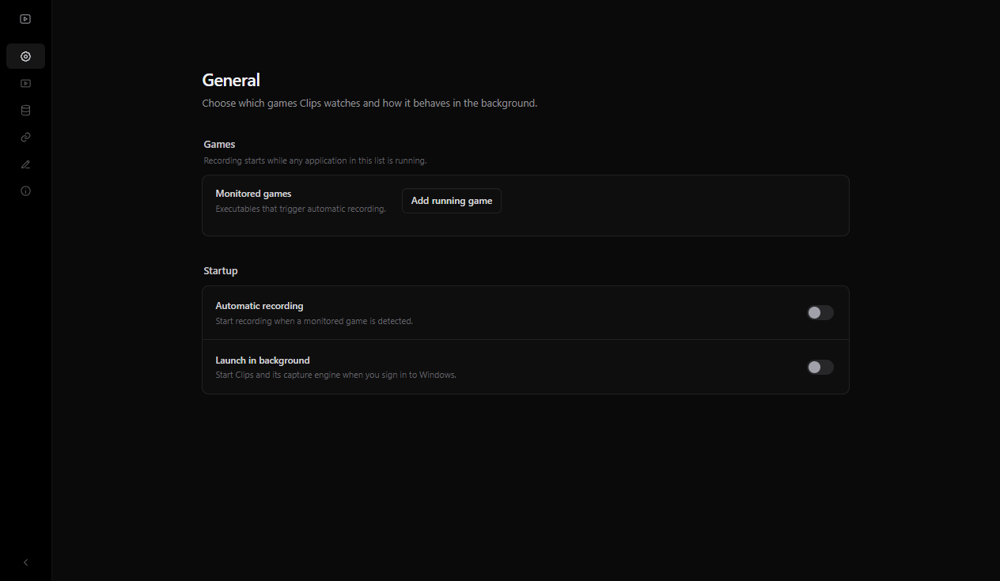

# Clips

Clips is a Windows app with a built-in capture engine built on top of libobs. The app detects chosen executables and starts recording automatically.

Download the latest stable version at: https://clips.jss.fi/download/ (or from the releases page below)

Browse all stable and nightly releases at: https://github.com/jssfi/clips/releases

Settings

## Features:

- Automatic recording
- Storage management (for when you eventually run out of disk space..)
- Clipping, choose what hotkey you want!
- Built-in overlay
- Trim the raw videos and mix the audio tracks (lower volume or mute them entirely!) inside the app
- Noise gate for mics and noise removal for NVIDIA RTX PC's.
- You can choose what quality to record at (Just make sure you have enough disk space!)
- Open Source, so you can fork and add the features you want! (I'll also gladly address any issues.)

## Privacy

- Official builds ask before sending optional telemetry, which is used to fix any bugs that might pop up.
- Source builds have telemetry disabled by default

## Development

Clips targets 64-bit Windows. See [Development and testing](docs/development.md) for more info.

## License

Original Clips code is available under the MIT License. Third-party components and source governed by another license retain their respective terms; see [LICENSE](LICENSE).

The native libobs and libmpv hosts are GPL-2.0-or-later. Exact versions, license variants, source archives, and build-recipe links for distributed dependencies are documented in [third-party notices](legal/THIRD_PARTY_NOTICES.md).
